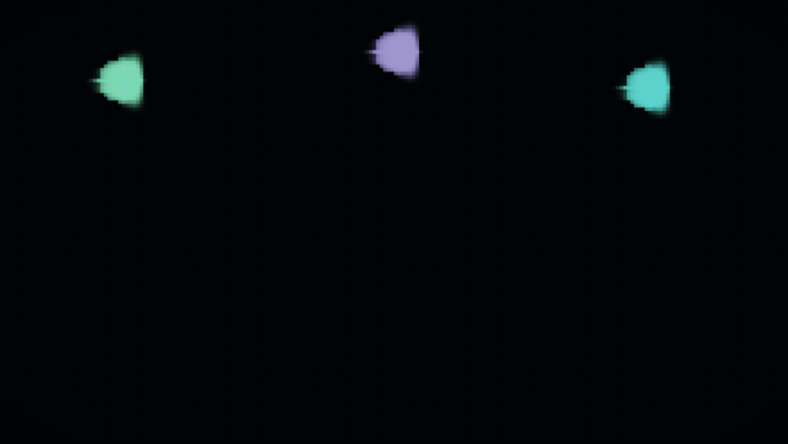

# 🌊 fluid-cinema

**EN:** A JSON-driven 2D Navier–Stokes fluid studio. Feed it one JSON file → it simulates real incompressible fluid dynamics and films the result as an animated GIF. Fire that draws itself, a Kármán vortex street behind a cylinder, RGB plumes tangling into impossible colors — all parameters, zero drawing.

**TR:** JSON ile çalışan 2B Navier–Stokes akışkan stüdyosu. Tek JSON ver → gerçek sıkıştırılamaz akışkan dinamiğini simüle eder ve sonucu animasyonlu GIF olarak filmler. Kendini çizen alev, silindir ardındaki Kármán girdap yolu, imkansız renklere karışan RGB tülleri — hepsi parametre, hiçbiri elle çizim değil.


## 🧮 The physics / Fizik

**EN:** Jos Stam's *Stable Fluids* (semi-Lagrangian advection + Jacobi pressure projection), plus **vorticity confinement** for crisp swirls, **buoyancy** from a temperature field for fire and plumes, **CFL sub-stepping** so fast flows stay stable, and a checkerboard-damping velocity filter. Written from scratch in NumPy — no simulation library.

**TR:** Jos Stam'ın *Stable Fluids*'i (yarım-Lagrange adveksiyon + Jacobi basınç projeksiyonu), üstünde keskin girdaplar için **vortisite hapsedme**, alev ve tüller için sıcaklık alanından **yüzdürme**, hızlı akışların stabil kalması için **CFL alt-adımları** ve damalı kararsızlığı baskılayan hız filtresi. Sıfırdan, yalnızca NumPy ile — simülasyon kütüphanesi yok.

## 🖼️ Gallery / Galeri

### 🔥 Fire / Ateş — [`scenes/fire.json`](scenes/fire.json)

Three emitters, a temperature field, buoyancy: the fire draws itself. — *Üç enjektör, sıcaklık alanı, yüzdürme: alev kendini çizer.*

### 🌬️ Wind Tunnel / Rüzgar Tüneli — [`scenes/windtunnel.json`](scenes/windtunnel.json)

A cylinder in steady wind splits two dye streams — watch the wake. — *Sabit rüzgarda silindir iki boya akımını bölüyor — ardındaki türbülansa bak.*

### 🟣 Nebula / Bulutsu — [`scenes/nebula.json`](scenes/nebula.json)

Violet and rose plasma rising in slow motion — a nebula in a box. — *Ağır çekimde yükselen mor ve gül plazma — kutu içinde bulutsu.*

### 🌈 Plume / Tül — [`scenes/plume.json`](scenes/plume.json)

RGB columns rise, tangle and mix into colors that never existed. — *RGB sütunları yükselir, dolanır ve hiç var olmamış renklere karışır.*

### 🌊 Ocean / Okyanus — [`scenes/ocean.json`](scenes/ocean.json)

Surface wind over rising deep currents — the sea in a box. — *Yüzey rüzgarı, derinden yükselen akıntıyla — kutu içinde deniz.*

### 🌌 Aurora / Kutup Işıkları — [`scenes/aurora.json`](scenes/aurora.json)

Slow silk bands of green and violet drifting on a thin wind. — *İnce rüzgarda süzülen yeşil ve mor ipek bantlar.*

## 🚀 Usage / Kullanım

```bash
pip install numpy          # tek bağımlılık
# GIF için ffmpeg (brew install ffmpeg)

python3 fluid.py --scene scenes/fire.json
python3 fluid.py --scene scenes/fire.json --preview   # hızlı kaba deneme
```

Requires **Python 3.9+ and NumPy**. Nothing else. (ffmpeg only stitches the GIF; without it you still get every frame as PNG.)

## 🎛️ Everything is a parameter / Her şey parametre

```jsonc
{
  "sim": {
    "cols": 220, "rows": 124, "steps": 300, "upscale": 4, "fps": 30,
    "viscosity": 0.0002,     // akışkanın yapışkanlığı
    "dissipation": 0.98,     // boyanın sönüm hızı
    "vorticity": 4.0,        // girdap keskinliği (hapsedme)
    "buoyancy": 0.35,        // sıcaklık -> yükselme (alev için)
    "pressure_iters": 40,    // Poisson çözücü turu
    "velocity_smoothing": 0.25  // damalı kararsızlık filtresi
  },
  "background": { "color": [12, 6, 3], "vignette": 0.5, "exposure": 1.5 },
  "sources": [
    { "pos": [0.5, 0.95], "radius": 0.07, "color": [1.0, 0.2, 0.04],
      "velocity": [0, -1.6], "emit": "jet",       // jet | smolder | burst
      "rate": 1.8, "temperature": 15 }
  ],
  "forces":    [{ "type": "vortex", "pos": [0.3, 0.35], "radius": 0.28, "strength": 2.2 },
                { "type": "wind",   "dir": [1.0, 0], "strength": 1.2 }],
  "obstacles": [{ "pos": [0.55, 0.5], "radius": 0.09 }]
}
```

## 🧪 Why / Neden

**TR:** Akışkan simülasyonu denince akla ya oyun motoru ya da 50 bin satırlık araştırma kodu gelir. Bu proje ikisinin arasında bir yer kanıtlıyor: bir ders kitabı makalesi (Stam, 1999), ~350 satır NumPy ve JSON — gerçek fizik, sinematik çıktı. Blender projesi hazır render motorunu kullandı; bu proje fiziği kendisi çözüyor. Yolda öğrenilenler: açık sınır kütle yutar, CFL'yi aşan hız damalı kararsızlık üretir, "güçlü kuvvet" her zaman "güzel görüntü" demektir — aksini üç kez bozuk render kanıtladı.

## 📄 License

MIT
